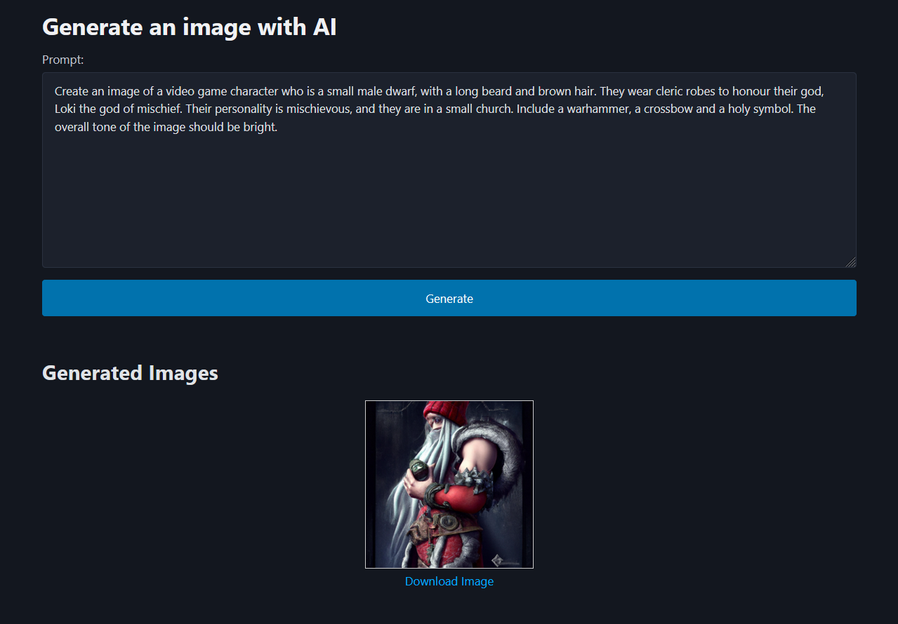

# Generate an AI Image with a simple Django Application

A small web application built using Python and Django to generate AI images based on a user's prompt.

## Application Dependencies

- [Astral's UV](https://docs.astral.sh/uv/).

## Running the Application

1. Clone the repository.
2. Create a `.env` file using `.env.example` as a reference.
3. Add your own Openai API Key to the `.env` file.
4. Run the Django app using `uv run manage.py runserver`.
5. Generate an image in your browser at `http://127.0.0.1:8000/`.
